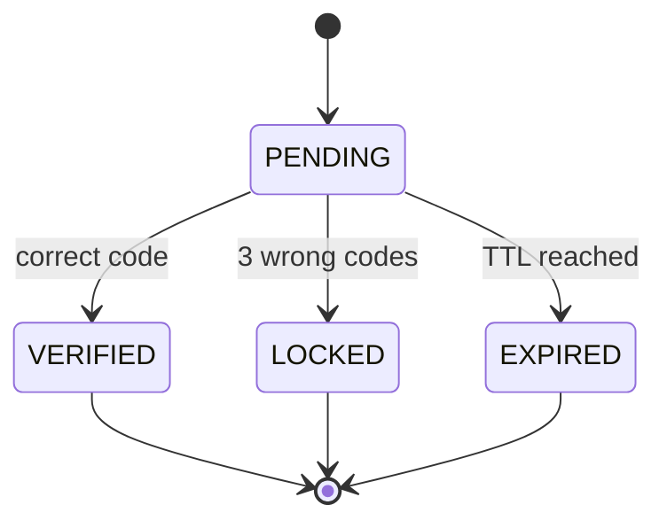
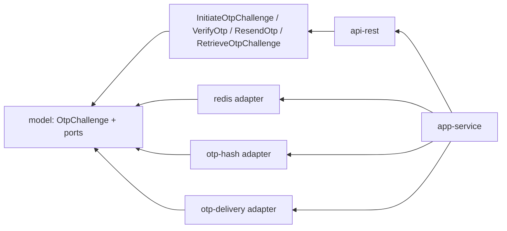
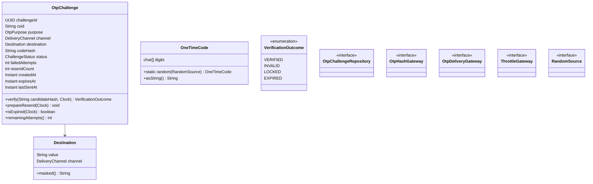

# 04 · otp-service — Party Authentication / One-Time Passcode (Junior 4/5)

---

## 1. Project Overview

| Attribute | Value |
|-----------|-------|
| Level | Junior (4 of 5) |
| BIAN Service Domain | Party Authentication |
| BIAN Control Record | Party Authentication Assessment (Assess pattern) |
| Behavior Qualifier modeled | One-time passcode factor |
| Technical microservice | `otp-service` |
| Base package | `co.com.portfolio.otp` |
| Scaffold type | `imperative` |
| Stack | Java 21 · Spring MVC · Spring Data Redis (`RedisTemplate`) · AWS Secrets Manager |
| Error prefix | `OTP` |

**Elevator pitch.** Generates and verifies short-lived, single-use numeric passcodes used as a **second security factor** (possession of the registered phone or email). The service stores only a keyed hash of each code, limits attempts, throttles generation per customer, and delegates delivery through a port so the channel (SMS, email, push) can change without touching the domain.

---

## 2. Business Context and Functional Scope

**In scope**

| ID | Requirement |
|----|-------------|
| FR-01 | Initiate an OTP challenge for a CSID, purpose and delivery channel; deliver the code through `OtpDeliveryGateway`. |
| FR-02 | Verify a code against a challenge; a successful verification consumes the challenge. |
| FR-03 | Resend the code for an existing challenge (new code, same challenge). |
| FR-04 | Retrieve challenge status (never the code). |

**Challenge lifecycle**



**Business rules**

| Rule | Description |
|------|-------------|
| BR-01 | Code: 6 digits from `SecureRandom`, uniformly distributed (`000000`–`999999`, leading zeros preserved). |
| BR-02 | TTL 300 s; the Redis key TTL and the domain `expiresAt` must agree. |
| BR-03 | Max 3 verification attempts; the 3rd failure moves to `LOCKED`. |
| BR-04 | Resend: cooldown 30 s, max 3 resends per challenge; each resend invalidates the previous code and resets `expiresAt`, **not** the attempt counter. |
| BR-05 | Throttle: max 5 challenges per CSID per 15-minute window. |
| BR-06 | Stored value = HMAC-SHA256(pepper, `challengeId:code`); comparison in constant time. |
| BR-07 | Verification response never distinguishes "unknown challenge" from "expired" (anti-enumeration). |
| BR-08 | Purposes: `LOGIN_STEP_UP`, `TRANSACTION_CONFIRMATION`, `DEVICE_ENROLLMENT`, `CONTACT_VERIFICATION`. A code verifies only for the purpose it was created for. |

---

## 3. Architecture and Learning Objectives

**Learning objectives**
1. Generate secrets correctly (`SecureRandom`, not `Random`/`Math.random`).
2. Store secrets as keyed hashes and compare with `MessageDigest.isEqual`.
3. Model TTL in the domain with `Clock`, and in infrastructure with Redis expiry.
4. Implement a sliding counter throttle in Redis (`INCR` + `EXPIRE` on first increment).
5. Design a delivery **port** with a local-only adapter that cannot accidentally ship to production.

**Dependency direction**



**Scaffold commands**

```shell
gradle ca --package=co.com.portfolio.otp --type=imperative --name=OtpService --lombok=true --java-version=21
gradle gm  --name=OtpChallenge
gradle guc --name=InitiateOtpChallenge
gradle guc --name=VerifyOtp
gradle guc --name=ResendOtp
gradle guc --name=RetrieveOtpChallenge
gradle gep --type=restmvc --server=tomcat
gradle gda --type=redis --mode=template
gradle gda --type=secrets --secrets-backend=aws_secrets_manager
gradle gda --type=generic --name=otp-hash
gradle gda --type=generic --name=otp-delivery
```

---

## 4. Detailed Domain Model



| Enum | Values |
|------|--------|
| `OtpPurpose` | `LOGIN_STEP_UP`, `TRANSACTION_CONFIRMATION`, `DEVICE_ENROLLMENT`, `CONTACT_VERIFICATION` |
| `DeliveryChannel` | `SMS`, `EMAIL` |
| `ChallengeStatus` | `PENDING`, `VERIFIED`, `LOCKED`, `EXPIRED` |

**Why `RandomSource` is a port.** `SecureRandom` is in the JDK, so the domain *could* call it; making it a port lets tests inject a deterministic source and makes the security-critical dependency explicit in `UseCasesConfig`.

---

## 5. Detailed Class and Package Specification

```text
domain/model/.../model/
├── otpchallenge/
│   ├── OtpChallenge.java · ChallengeStatus.java · OtpPurpose.java · DeliveryChannel.java · VerificationOutcome.java
│   ├── Destination.java · OneTimeCode.java
│   └── gateways/ OtpChallengeRepository.java · OtpHashGateway.java · OtpDeliveryGateway.java · ThrottleGateway.java · RandomSource.java
└── exception/ BusinessException.java · BusinessErrorMessage.java
domain/usecase/.../usecase/
├── initiateotpchallenge/ InitiateOtpChallengeUseCase.java · InitiateOtpCommand.java
├── verifyotp/ VerifyOtpUseCase.java · VerifyOtpResult.java
├── resendotp/ ResendOtpUseCase.java
└── retrieveotpchallenge/ RetrieveOtpChallengeUseCase.java
infrastructure/entry-points/api-rest/.../api/
├── OtpChallengeController.java
├── dto/ InitiateOtpRequest.java · VerifyOtpRequest.java · OtpChallengeResponse.java · OtpVerificationResponse.java · ResponseEnvelope.java · Meta.java · ErrorResponse.java
└── handler/GlobalExceptionHandler.java
infrastructure/driven-adapters/redis/.../redis/
├── RedisOtpChallengeAdapter.java · OtpChallengeRedisRecord.java
└── RedisThrottleAdapter.java
infrastructure/driven-adapters/otp-hash/.../otphash/ HmacOtpHashAdapter.java · SecureRandomSource.java
infrastructure/driven-adapters/otp-delivery/.../otpdelivery/ LocalConsoleOtpDeliveryAdapter.java
applications/app-service/.../config/ UseCasesConfig.java · ClockConfig.java · DeliveryGuardConfig.java
```

**Signatures**

```java
public interface OtpChallengeRepository {
    void save(OtpChallenge challenge, Duration ttl);
    Optional<OtpChallenge> findById(UUID challengeId);
    void delete(UUID challengeId);
}
public interface OtpHashGateway    { String hash(UUID challengeId, String code); boolean matches(String storedHash, String candidateHash); }
public interface OtpDeliveryGateway{ void deliver(Destination destination, OtpPurpose purpose, String code, Instant expiresAt); }
public interface ThrottleGateway   { long incrementAndGet(String key, Duration window); }
public interface RandomSource      { int nextInt(int boundExclusive); }

public record InitiateOtpCommand(String csid, OtpPurpose purpose, DeliveryChannel channel, String destination) {}
public record VerifyOtpResult(VerificationOutcome outcome, int remainingAttempts) {}

public class InitiateOtpChallengeUseCase { public OtpChallenge initiate(InitiateOtpCommand command); }
public class VerifyOtpUseCase            { public VerifyOtpResult verify(UUID challengeId, OtpPurpose purpose, String code); }
public class ResendOtpUseCase            { public OtpChallenge resend(UUID challengeId); }
public class RetrieveOtpChallengeUseCase { public OtpChallenge retrieve(UUID challengeId); }

@RestController @RequestMapping("/party-authentication/v1/otp-challenges")
public class OtpChallengeController {
    public ResponseEntity<ResponseEnvelope<OtpChallengeResponse>> initiate(String clientId, UUID messageId, UUID idempotencyKey, InitiateOtpRequest body);
    public ResponseEntity<ResponseEnvelope<OtpVerificationResponse>> verify(String clientId, UUID messageId, UUID challengeId, VerifyOtpRequest body);
    public ResponseEntity<ResponseEnvelope<OtpChallengeResponse>> resend(String clientId, UUID messageId, UUID challengeId);
    public ResponseEntity<ResponseEnvelope<OtpChallengeResponse>> retrieve(String clientId, UUID messageId, UUID challengeId);
}
```

**`DeliveryGuardConfig`** registers `LocalConsoleOtpDeliveryAdapter` only under profile `local` (`@Profile("local")`) and fails startup (`IllegalStateException`) if no real `OtpDeliveryGateway` bean exists in any other profile. Project 10 supplies the real Kafka-based adapter.

**DTOs**

| DTO | Fields |
|-----|--------|
| `InitiateOtpRequest` | `csid`, `purpose`, `deliveryChannel`, `destination` (`@Size(max=254)`) |
| `VerifyOtpRequest` | `purpose`, `code` `@Pattern("^\\d{6}$")` |
| `OtpChallengeResponse` | `challengeId`, `purpose`, `deliveryChannel`, `destinationMasked`, `status`, `expiresAt`, `resendAvailableAt`, `remainingResends` |
| `OtpVerificationResponse` | `challengeId`, `result` (`VERIFIED`\|`INVALID`), `remainingAttempts` |

---

## 6. API and OpenAPI Contract (Contract-First)

```yaml
openapi: 3.0.3
info:
  title: Party Authentication - OTP Challenge API
  version: 1.0.0
security:
  - bearerAuth: []
paths:
  /party-authentication/v1/otp-challenges:
    post:
      operationId: initiateOtpChallenge
      summary: BIAN Initiate - Party Authentication Assessment (OTP factor)
      parameters:
        - $ref: '#/components/parameters/ClientId'
        - $ref: '#/components/parameters/MessageId'
        - $ref: '#/components/parameters/IdempotencyKey'
      requestBody:
        required: true
        content: { application/json: { schema: { $ref: '#/components/schemas/InitiateOtpRequest' } } }
      responses:
        '201': { description: Challenge created and code sent, content: { application/json: { schema: { $ref: '#/components/schemas/ChallengeEnvelope' } } } }
        '422': { $ref: '#/components/responses/Error' }
        '429':
          description: Too many challenges
          headers: { Retry-After: { schema: { type: integer } } }
          content: { application/json: { schema: { $ref: '#/components/schemas/ErrorResponse' } } }
  /party-authentication/v1/otp-challenges/{challengeId}:
    get:
      operationId: retrieveOtpChallenge
      parameters:
        - $ref: '#/components/parameters/ClientId'
        - $ref: '#/components/parameters/MessageId'
        - $ref: '#/components/parameters/ChallengeId'
      responses:
        '200': { description: Status, content: { application/json: { schema: { $ref: '#/components/schemas/ChallengeEnvelope' } } } }
        '404': { $ref: '#/components/responses/Error' }
  /party-authentication/v1/otp-challenges/{challengeId}/verification:
    post:
      operationId: verifyOtp
      summary: BIAN Evaluate - OTP factor
      parameters:
        - $ref: '#/components/parameters/ClientId'
        - $ref: '#/components/parameters/MessageId'
        - $ref: '#/components/parameters/ChallengeId'
      requestBody:
        required: true
        content: { application/json: { schema: { $ref: '#/components/schemas/VerifyOtpRequest' } } }
      responses:
        '200': { description: Evaluated (VERIFIED or INVALID), content: { application/json: { schema: { $ref: '#/components/schemas/VerificationEnvelope' } } } }
        '422': { $ref: '#/components/responses/Error' }
  /party-authentication/v1/otp-challenges/{challengeId}/resend:
    post:
      operationId: resendOtp
      parameters:
        - $ref: '#/components/parameters/ClientId'
        - $ref: '#/components/parameters/MessageId'
        - $ref: '#/components/parameters/ChallengeId'
      responses:
        '200': { description: New code sent, content: { application/json: { schema: { $ref: '#/components/schemas/ChallengeEnvelope' } } } }
        '422': { $ref: '#/components/responses/Error' }
        '429': { $ref: '#/components/responses/Error' }
components:
  securitySchemes:
    bearerAuth: { type: http, scheme: bearer, bearerFormat: JWT }
  parameters:
    ClientId: { name: X-Client-Id, in: header, required: true, schema: { type: string, maxLength: 64 } }
    MessageId: { name: X-Message-Id, in: header, required: true, schema: { type: string, format: uuid } }
    IdempotencyKey: { name: Idempotency-Key, in: header, required: true, schema: { type: string, format: uuid } }
    ChallengeId: { name: challengeId, in: path, required: true, schema: { type: string, format: uuid } }
  responses:
    Error: { description: Error, content: { application/json: { schema: { $ref: '#/components/schemas/ErrorResponse' } } } }
  schemas:
    Purpose: { type: string, enum: [LOGIN_STEP_UP, TRANSACTION_CONFIRMATION, DEVICE_ENROLLMENT, CONTACT_VERIFICATION] }
    InitiateOtpRequest:
      type: object
      required: [csid, purpose, deliveryChannel, destination]
      properties:
        csid: { type: string, pattern: '^CS[A-Z2-7]{16}$' }
        purpose: { $ref: '#/components/schemas/Purpose' }
        deliveryChannel: { type: string, enum: [SMS, EMAIL] }
        destination: { type: string, maxLength: 254, writeOnly: true }
    VerifyOtpRequest:
      type: object
      required: [purpose, code]
      properties:
        purpose: { $ref: '#/components/schemas/Purpose' }
        code: { type: string, pattern: '^\d{6}$', writeOnly: true }
    OtpChallenge:
      type: object
      properties:
        challengeId: { type: string, format: uuid }
        purpose: { $ref: '#/components/schemas/Purpose' }
        deliveryChannel: { type: string }
        destinationMasked: { type: string, example: '*******4567' }
        status: { type: string, enum: [PENDING, VERIFIED, LOCKED, EXPIRED] }
        expiresAt: { type: string, format: date-time }
        resendAvailableAt: { type: string, format: date-time }
        remainingResends: { type: integer }
    OtpVerification:
      type: object
      properties:
        challengeId: { type: string, format: uuid }
        result: { type: string, enum: [VERIFIED, INVALID] }
        remainingAttempts: { type: integer }
    Meta:
      type: object
      properties:
        messageId: { type: string, format: uuid }
        clientId: { type: string }
        timestamp: { type: string, format: date-time }
    ChallengeEnvelope:
      type: object
      properties:
        data: { type: object, properties: { meta: { $ref: '#/components/schemas/Meta' }, payload: { $ref: '#/components/schemas/OtpChallenge' } } }
    VerificationEnvelope:
      type: object
      properties:
        data: { type: object, properties: { meta: { $ref: '#/components/schemas/Meta' }, payload: { $ref: '#/components/schemas/OtpVerification' } } }
    ErrorResponse:
      type: object
      properties:
        meta: { $ref: '#/components/schemas/Meta' }
        errors:
          type: array
          items: { type: object, properties: { code: { type: string }, type: { type: string }, title: { type: string }, detail: { type: string } } }
```

**Verify request / response**

```json
{ "purpose": "TRANSACTION_CONFIRMATION", "code": "048213" }
```

```json
{
  "data": {
    "meta": { "messageId": "5d1e2f3a-4b5c-4d6e-8f70-819a2b3c4d5e", "clientId": "mfa-service", "timestamp": "2026-09-22T16:05:12.000Z" },
    "payload": { "challengeId": "c1d2e3f4-a5b6-4c7d-8e9f-0a1b2c3d4e5f", "result": "INVALID", "remainingAttempts": 1 }
  }
}
```

---

## 7. Error Handling and Security

| Code | HTTP | Type | Trigger |
|------|------|------|---------|
| OTP-001 | 429 | BUSINESS | Generation throttle exceeded (BR-05), `Retry-After` set to window remainder |
| OTP-002 | 429 | BUSINESS | Resend cooldown not elapsed |
| OTP-003 | 422 | BUSINESS | Max resends reached |
| OTP-004 | 422 | BUSINESS | Challenge expired **or not found** (BR-07) |
| OTP-005 | 422 | BUSINESS | Challenge locked |
| OTP-006 | 422 | BUSINESS | Purpose mismatch |
| OTP-007 | 400 | VALIDATION | Bean Validation failure |
| OTP-500 | 503 | TECHNICAL | Redis or delivery unavailable (fail closed: no challenge without delivery) |

**Security**
- Wrong code → `200` with `INVALID`: the evaluation succeeded; the code was wrong.
- The code never appears in logs, responses, metrics, exception messages or Redis in clear.
- Pepper for `HmacOtpHashAdapter` loaded from Secrets Manager (reuse the pattern from project 02).
- Only trusted service clients (`mfa-service`, onboarding) may call this service; end-user apps go through `mfa-service`.

---

## 8. Persistence and Infrastructure

| Redis key | Type | TTL | Content |
|-----------|------|-----|---------|
| `otp:challenge:{challengeId}` | Hash | 300 s (reset on resend) | `csid`, `purpose`, `channel`, `destination`, `codeHash`, `status`, `failedAttempts`, `resendCount`, `createdAt`, `expiresAt`, `lastSentAt` |
| `otp:throttle:{csid}` | String counter | 900 s from first increment | challenges created in window |

Terminal challenges (`VERIFIED`, `LOCKED`) are kept until TTL for status queries, then disappear; nothing persists beyond 5 minutes by design.

```yaml
spring:
  application.name: otp-service
  data:
    redis:
      host: ${REDIS_HOST}
      port: 6379
      ssl.enabled: true
      timeout: 500ms
otp:
  length: 6
  ttl: PT5M
  max-attempts: 3
  resend-cooldown: PT30S
  max-resends: 3
  throttle:
    max-per-window: 5
    window: PT15M
  pepper-secret-name: ${OTP_PEPPER_SECRET_NAME:portfolio/otp/pepper}
```

---

## 9. Observability, Privacy, SLA and Production Requirements

| Item | Specification |
|------|---------------|
| Metrics | `otp_challenges_created_total{purpose,channel}`, `otp_verifications_total{outcome}`, `otp_throttled_total`, `otp_delivery_failures_total{channel}` |
| Alerts | Spike in `outcome=LOCKED` ratio > 5 % over 10 min (possible brute force campaign) |
| Privacy | Destination stored only for the TTL; logs show `destinationMasked` only. |
| SLO | Initiate p95 < 150 ms (excluding provider delivery), verify p95 < 50 ms, 99.95 %. |
| Security review | Brute-force math: attempts are not reset by resends, so an attacker gets 3 guesses per challenge against 10⁶ codes (≈ 1 in 333,000); the throttle caps this at 15 guesses per CSID per 15-minute window. |

---

## 10. CI/CD and Deployment Strategy

| Stage | Detail |
|-------|--------|
| Build | Domain tests with a fixed `Clock` and scripted `RandomSource` |
| Architecture | `validateStructure` |
| Startup guard | Pipeline deploys with `SPRING_PROFILES_ACTIVE=dev`; if only the local adapter exists the pod fails readiness — this is intended until project 10 |
| Infra | Amazon ElastiCache for Redis with in-transit encryption and AUTH token from Secrets Manager |

---

## 11. Interview Preparation and Portfolio Evaluation

**Talking point:** "OTPs have a tiny keyspace, so a plain hash is reversible offline. I store an HMAC bound to the challenge ID, compare in constant time, and let the attempt limit plus throttle do the rest."

| Criterion | Weight | Evidence |
|-----------|--------|----------|
| Secret generation & storage | 30 % | `SecureRandom`, keyed hash, constant-time compare |
| Abuse controls | 25 % | Attempts, resend cooldown, throttle, anti-enumeration |
| Domain modeling | 20 % | State rules in `OtpChallenge`, Clock-driven |
| Port design | 15 % | Delivery swappable, local-only guard |
| Contract fidelity | 10 % | `INVALID` as 200, `writeOnly` fields |

---

## Mentorship Guidance

**Practice coding yourself**
1. `OneTimeCode.random()` — produce 6 digits using `nextInt(1_000_000)` and zero-pad; test that `7` becomes `"000007"`.
2. `OtpChallenge.verify()` — order matters: check expiry → status → purpose → hash; increment attempts on mismatch; lock on the 3rd.
3. `RedisThrottleAdapter.incrementAndGet()` — `INCR`, and if the result is `1`, set `EXPIRE`. Then explain the tiny race if the process dies between the two commands and how a Lua script removes it (you'll write that Lua script in project 08).
4. `DeliveryGuardConfig` startup check.

**Common mistakes**
- `new Random()` or `ThreadLocalRandom` for codes.
- `String.equals` on hashes (timing leak).
- Resetting `failedAttempts` on resend (turns 3 attempts into 12).
- Logging the code "only in DEBUG".
- Returning `404` for unknown challenge IDs (enumeration oracle).

**Interview questions**
1. Why HMAC with the challenge ID instead of BCrypt for a 6-digit code?
2. Walk through what happens if Redis evicts a key under memory pressure mid-challenge.
3. How would you make verify-and-consume atomic across two pods?
4. Why is OTP over SMS considered a weaker possession factor, and what would you replace it with? (Preview of project 05.)
5. Should a failed delivery still count toward the throttle? Argue both sides.
